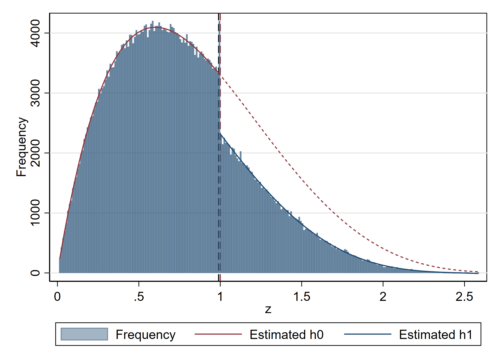

# polbunch
Efficient and theoretical polynomial bunching estimation. Implements various polynomial bunching estimators from Saez (2010), Chetty et. al (2011) and the efficient estimator from Andresen (2025). Provides binned bootstrap procedure and analytical standard errors that may estimate standard errors even with pre-binned data.. In development, bugs are likely. Report through GitHub or martin.eckhoff.andresen@gmail.com

## Estimates bunching 

## Installing development version
net install polbunch, from (https://raw.githubusercontent.com/martin-andresen/polbunch/master/)
